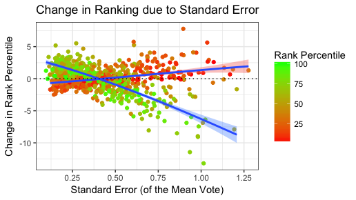

## Introduction

Film festivals present an Audience Choice award to films based on the ranking of votes. The voting is typically a 5-star range system, where audience members can give a film an integer score between 1 and 5. An algorithm is then used to rank the films. But what's a good algorithm to use?

### 1. Average Score
The simplest approach is to order the films by their mean scores. This approach fails, however, to take into account the number of people who voted -- which should arguably be considered when ranking popularity. It is reasonable to claim that a film for which 200 voters gave an average of 4.5 stars should be ranked higher than a film for which 20 voters gave an average of 4.51 stars. The question is: how can we quantify this tradeoff between average score and audience size?

### 2. Weighted Average Score
One possible solution lies in [the method IMDb uses](https://www.quora.com/What-algorithm-does-IMDB-use-for-ranking-the-movies-on-its-site) to compute their top 250 film list: a weighted mean. IMDb blends the mean estimate $\hat{\mu_i}$ for film $i$ with the grand mean of all the films $\bar{\mu}$. Specifically, the formula is $n_i/(n_i+n_{min}) \hat{\mu_i} + n_{min}/(n_i+n_{min}) \bar{\mu}$, where $n_i$ is the audience size, and $n_{min}$ is like a minimum audience size required to be listed in the Top 250. More simply, $n_{min}$ is just a force that pushes the score towards the grand mean; if an audience is large enough it will outweight this force, but small audiences are strongly affected. This method is easy to compute, but it is entirely up to the user to set this parameter, and therefore a degree of subjectivity remains: multiple users can get different rankings.

### 3. The FilmRank algorithm
We wanted to design an algorithm that exhibits similar behavior, but without any free parameters. FilmRank accomplishes this nonparametrically, using resampling to estimate the probability of different rankings directly from the data. The FilmRank ranking algorithm bootstraps the probability that the average score $\mu_i$ of film $i$ is truly greater than any other film $j$, by resampling the votes to simulate the universe of all possible rankings. This matrix of probabilities $p_{ij}=p(\mu_j \gt \mu_i)$ is then treated as a weighted directed graph, and the [authority score](http://citeseerx.ist.psu.edu/viewdoc/summary?doi=10.1.1.418.3908) $\text{eig}_1(p^Tp)$ is used to rank the films, in a way similar to Google *page-rank*.

## How do the results compare?
Like IMDb's method, FilmRank is asymptotically equivalent to the naive ordering -- in the limit where all audience sizes are large, they give the same results. Also like IMDb, when small audiences are present, FilmRank pushes them towards the median, exhibiting the qualitative behavior we aimed to achieve. The primary achievement is that FilmRank achieves this behavior nonparametrically, so there is no longer room for subjectivity. 

Below we show the change in rank (FilmRank compared to naive rank) for 1000 random IMDb films as a function of the uncertainty (i.e. standard error) of their average score (which is inversely proportional to the audience size). Films that are ranked highly are negatively impacted by large uncertainty, while films that are ranked lowly are positively impacted; FilmRank pushes small films toward the median. For a more detailed examination, [see this notebook](https://nwisn.github.io/FilmRank/results_IMDb.html).

## How do I use the algorithm?
The algorithm exists as an [R](https://www.r-project.org/) package, which can be installed from [github](https://github.com/nwisn/FilmRank) by typing the following commands into R:

`install.packages("devtools")`

`library(devtools)`

`install_github("nwisn/FilmRank", build_vignettes = TRUE)`

An [example usage](https://nwisn.github.io/FilmRank/results_IMDb.html) exists on publicly-available IMDb voting data, and more information can be found by typing:

`vignette("FilmRank")`

and further help can be found by typing:

`?filmrank`

## References
[[1](http://citeseerx.ist.psu.edu/viewdoc/summary?doi=10.1.1.418.3908)] Kleinberg, J. M. (1999). Authoritative sources in a hyperlinked environment. *Journal of the ACM (JACM)*, 46(5), 604-632.

