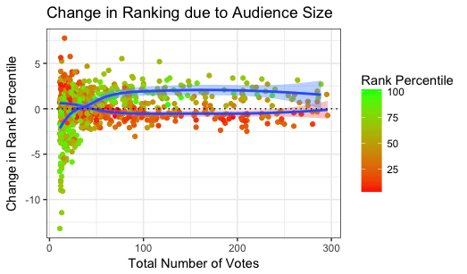
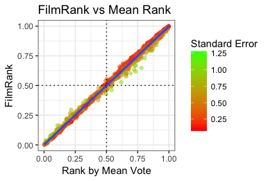

Here we illustrate the results of the `FilmRank` algorithm using a subsample of publicly-available range-voting data taken from IMDb. First, we compute the rankings on a small subset of data, in order to illustrate the individual differences between FilmRank's ordering and the usual ordering. Then, we run the algorithm on 1000 films, in order to examine how the differences between rankings are statistically driven by other factors -- like audience size. We show how this leads to the main characteristic of FilmRank: films with small audiences get pushed towards the median rank.


```{r libraries}
suppressMessages(require(FilmRank))
suppressMessages(require(knitr))
suppressMessages(require(kableExtra))
suppressMessages(require(ggsci))
suppressMessages(require(ggplot2movies))
suppressMessages(require(reshape2))

# get a subset of IMDb movies
set.seed(137)
movies.subgroups <- movies$year == 2003 & movies$votes < 100 & movies$votes > 2 # make some cuts
subsample.ix <- sample(1:sum(movies.subgroups), 100, replace = F) # subsample films
movies.selection <- movies[movies.subgroups,][subsample.ix,]

# reshape the genre columns 
movies.melt0 <- melt(movies.selection, 
     id.vars = colnames(movies)[1:17],
     variable.name = "type", 
     value.name = "type.yes")
movies.melt <- movies.melt0[movies.melt0$type.yes == 1,]
movies.unique <- do.call(rbind, lapply(split(movies.melt, movies.melt$title), function(x) x[1,]))

# transform percentile vote columns r1-r10 into counts
movies.unique[,c(7:16)] <- round(movies.unique[,c(7:16)]/rowSums(movies.unique[,c(7:16)]) * movies.unique$votes)

# shorten the titles for display purposes
movies.unique$title <- substr(movies.unique$title, 1, 20)

```


```{r header}
#______________________________________
# dataset

#csv.name <- file.path("../", "data", "IMDb_example.csv")
#csv <- read.csv(csv.name, header=T)
csv <- movies.unique
title.colname <- "title"
type.colname <- "type" 
vote.colnames <- paste0("r", 1:10)
score = function(x) mean(x, trim = 0)
nboot <- 100
minvote <- 2

#______________________________________
# run analysis
run <- suppressWarnings(suppressMessages(filmrank(csv,
                                               title.colname = title.colname,
                                               type.colname = type.colname,
                                               vote.colnames = vote.colnames,
                                               score = score,
                                               nboot = nboot,
                                               minvote = minvote,
                                               seed = 137,
                                               ncores = NULL)
))
```

# Results {.tabset .tabset-pills .tabset-fade}

We began by running FilmRank on a subset of films. We ranked several TYPEs of films, and highlighted the 3 largest categories (Documentaries, Dramas, and Shorts) for the sake of illustration; each is shown in a different color. In the table below, the average vote is shown in the column labeled AVG, and the number of total votes is shown in the column labeled VOTES. The authority score is shown in the column labeled AUTHORITY, and is used to determine the ranking. Note: the rankings within a subgroup of films may be slightly different than the order in the overall rankings (see [algorithm](#algorithm)).

## Overall

```{r overall}
#______________________________________
# plots
this_table <- run$data[order(run$data$authority, decreasing = T),
                       c(title.colname, type.colname, "Total", "mean", "authority")]
rownames(this_table) <- as.character(1:nrow(this_table))

kable(this_table, 
      digits = 3,
      row.names = T, 
      col.names = c("FILM","TYPE", "VOTES", "AVG", "AUTHORITY"),
      caption = "Overall Rankings") %>%
    kable_styling(bootstrap_options = c("striped", "hover", "condensed", "responsive"),
                  font_size = 14) %>%
    row_spec(which(this_table[[type.colname]] == "Drama"), bold = F, color = "#CE3D32FF") %>%
    row_spec(which(this_table[[type.colname]] == "Documentary"), bold = F, color = "#5050FFFF") %>%
    row_spec(which(this_table[[type.colname]] == "Comedy"), bold = F, color = "#749B58FF") %>%
    scroll_box(width = "100%", height = "300px")
```


```{r subgraphs, eval = T}
# split graph into subgraphs for different film types
filmtypes <- levels(factor(run$data[[type.colname]]))
if(length(filmtypes) > 1){
    g <- run$g
    subgraphs <- sapply(filmtypes, function(this_type) induced_subgraph(g, v=which(V(g)$type %in% this_type)), simplify=F)
    
    # get subgraph scores
    subgraphs.authority <- lapply(subgraphs, function(this_g) authority.score(this_g)$vector)
    filmtypes.ix <- lapply(subgraphs.authority, function(this_subhub) match(names(this_subhub), V(g)$name))
    data.sub <- run$data
    data.sub[["authority"]][unlist(filmtypes.ix)] <- unlist(subgraphs.authority)
    data.subs <- split(data.sub, factor(data.sub[[type.colname]]))
} else {
    data.subs <- NULL
}


```

## Dramas

```{r features}
# plot filmtype-specific rankings
if(is.null(data.subs)){
    print("This category is not listed.")
} else if("Drama" %in% names(data.subs)){
    this_table <- data.subs[["Drama"]][order(data.subs[["Drama"]]$authority, decreasing = T),
                                   c(title.colname, type.colname, "Total", "mean", "authority")]
    rownames(this_table) <- as.character(1:nrow(this_table))
    
    kable(this_table, 
          digits = 3,
          row.names = T, 
          col.names = c("FILM","TYPE", "VOTES", "AVG", "AUTHORITY"),
          caption = "Drama Rankings") %>%
        kable_styling(bootstrap_options = c("striped", "hover", "condensed", "responsive"),
                      font_size = 14) %>%
    row_spec(which(this_table[[type.colname]] == "Drama"), bold = F, color = "#CE3D32FF") %>%
    row_spec(which(this_table[[type.colname]] == "Documentary"), bold = F, color = "#5050FFFF") %>%
    row_spec(which(this_table[[type.colname]] == "Comedy"), bold = F, color = "#749B58FF") %>%
        scroll_box(width = "100%", height = "300px")
}

```

## Documentaries

```{r docs}
if(is.null(data.subs)){
    print("This category is not listed.")
} else if("Documentary" %in% names(data.subs)){
    this_table <- data.subs[["Documentary"]][order(data.subs[["Documentary"]]$authority, decreasing = T),
                                   c(title.colname, type.colname,"Total", "mean", "authority")]
    rownames(this_table) <- as.character(1:nrow(this_table))
    
    kable(this_table, 
          digits = 3,
          row.names = T, 
          col.names = c("FILM","TYPE", "VOTES", "AVG", "AUTHORITY"),
          caption = "Documentary Rankings") %>%
        kable_styling(bootstrap_options = c("striped", "hover", "condensed", "responsive"),
                      font_size = 14) %>%
            row_spec(which(this_table[[type.colname]] == "Drama"), bold = F, color = "#CE3D32FF") %>%
    row_spec(which(this_table[[type.colname]] == "Documentary"), bold = F, color = "#5050FFFF") %>%
    row_spec(which(this_table[[type.colname]] == "Comedy"), bold = F, color = "#749B58FF") %>%
        scroll_box(width = "100%", height = "300px")
}
```

## Comedies

```{r shorts}
if(is.null(data.subs)){
    print("This category is not listed.")
} else if("Comedy" %in% names(data.subs)){
    this_table <- data.subs[["Comedy"]][order(data.subs[["Comedy"]]$authority, decreasing = T),
                                   c(title.colname, type.colname, "Total", "mean", "authority")]
    rownames(this_table) <- as.character(1:nrow(this_table))
    
    kable(this_table, 
          digits = 3,
          row.names = T, 
          col.names = c("FILM","TYPE", "VOTES", "AVG", "AUTHORITY"),
          caption = "Comedy Rankings") %>%
        kable_styling(bootstrap_options = c("striped", "hover", "condensed", "responsive"),
                      font_size = 14) %>%
    row_spec(which(this_table[[type.colname]] == "Drama"), bold = F, color = "#CE3D32FF") %>%
    row_spec(which(this_table[[type.colname]] == "Documentary"), bold = F, color = "#5050FFFF") %>%
    row_spec(which(this_table[[type.colname]] == "Comedy"), bold = F, color = "#749B58FF") %>%
        scroll_box(width = "100%", height = "300px")
}
```


# Visualization

We visualized the ranking system using a forest plot, so we could inspect individual differences between the FilmRank ranking and ranking by the mean. We found that, within the top ranked films, there are several flips in which a higher-scored film is ranked below a lesser film, and in each case it is due to the size of the error bars. In the figure below, the average vote is depicted by a square and a 95% confidence interval. The number of total votes is depicted by the size of the squares. The authority score is again used to determine the ranking.

```{r forestplot, fig.height = 14, fig_retina=2 }
# plot overall ranking
suppressMessages(
    plot(run,
         rankmetric = "authority",
         color.palette = pal_igv,
         cex.label = 0.75,
         xlim = c(1,10),
         cex.xlab = 1,
         cex.ticks = 0.75,
         boxsize = 1/200,
         new_page = T,
         title = "")
)
```


# About the Ranking Algorithm {#algorithm}

The FilmRank algorithm bootstraps the probability that the average score $\mu_i$ of film $i$ is truly greater than any other film $j$, by resampling the votes to simulate the universe of all possible rankings. This matrix of probabilities $p_{ij}=p(\mu_j \gt \mu_i)$ is then treated as a weighted directed graph, and the [authority score](http://citeseerx.ist.psu.edu/viewdoc/summary?doi=10.1.1.418.3908) $\text{eig}_1(p^Tp)$ is used to rank the films, in a way similar to Google *page-rank*.

### Why this algorithm?
This ranking system was designed to address a problem in estimating ranks introduced by the wide range of audience sizes at a film festival. Specifically, ranking based on naive ordering the mean scores can produce undesirable results. For example, a high scoring film that many people came to see (opening/closing night) can sometimes be beaten by a film that very few people came to see, but which also scored highly, only because of the increased sampling error in the small group. The FilmRank algorithm addresses this problem by using resampling to weigh the relative superiority of each film to every other, which can then produce more meaningful rankings using graph theory. 

### How are the results different?
This method is asymptotically equivalent to the naive ordering -- in the limit where all audience sizes are large, they give the same results. However, when both large and small audiences are present, this method tends to favor scores from larger audiences, which is desirable. 

To demonstrate this, we subsampled 1000 films from IMDb with under 300 total votes, and modeled the change in ranking due to audience size. We found that highly ranked films (green) with audiences under 100 people experienced a progressively steeper penalty moving them down in rank, towards the median. Similarly, films ranked at the bottom (red) experienced a small boost in rank, towards the median. For audiences over 100, the effect appears to plateau.

<center>

</center>

We also modeled the change in ranking alongside the standard error of the mean vote. The standard error increases for smaller audience sizes, and with more uncertainty in the voting scores. We found the same result as above, but slightly cleaner. Here, highly ranked films (green) experience a progressive penalty moving them down in rank, towards the median, as the standard error gets larger. Again, the films ranked at the bottom are slightly affected in the opposite direction -- they are boosted upwards toward the median.

<center>

</center>

The penalties in the above plots look very pronounced, but the rankings end up being very similar. FilmRank and the usual ranking are in fact highly correlated (r=0.9975). Now that we understand the effect of the standard error, it is easy to the same result in the correlation plot below. Here, films with high standard error (green) are moved down in rank if they are above median, and up in rank if they are below median. Meanwhile, films with low standard error (red) follow a straight line very closely.

<center>

</center>


### How do I use the algorithm?
The algorithm currently only exists as an [R](https://www.r-project.org/) package, which can be installed from [github](https://github.com/nwisn/FilmRank) by typing the following commands into R:

`install.packages("devtools")`

`library(devtools)`

`install_github("nwisn/FilmRank", build_vignettes = TRUE)`

An example use case can be found [here](https://github.com/nwisn/LAGFFRank/blob/master/vignettes/FilmRank.Rmd), and by typing:

`vignette("FilmRank")`

and further help can be found by typing:

`?filmrank`

# References
[[1](http://citeseerx.ist.psu.edu/viewdoc/summary?doi=10.1.1.418.3908)] Kleinberg, J. M. (1999). Authoritative sources in a hyperlinked environment. *Journal of the ACM (JACM)*, 46(5), 604-632.
